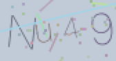

# 图形验证码



- 基于`canvas`实现
- 4位数图形验证码，数字加大小写字母
- 点击可以实现图片的变化

## 说明

定义`ImageVerify`类

参数：

| api | 说明 |
|--|--|
| id | canvas标签的唯一id，必填项 |
| width | canvas的宽度，默认 `90`|
| height | canvas的高度，默认 `48`| 

> 常言道重口难调，不满足需求的可`clone`之后自行更改

## demo

```vue
<template>
  <div>
    <canvas id="canvas" width="90" height="48" @click="handleClick"></canvas>
  </div>
</template>

<script>
import ImageVerify from "./components/image-verify.js";

export default {
  name: "App",
  data() {
    return {
      imageVerify: "",
    };
  },
  mounted() {
    this.imageVerify = new ImageVerify({
      id: 'canvas',
      width: 90,
      height: 48,
    });
  },
  methods: {
    handleClick() {
      this.imageVerify.start();
      console.log(this.imageVerify.code);
    },
  },
};
</script>
```